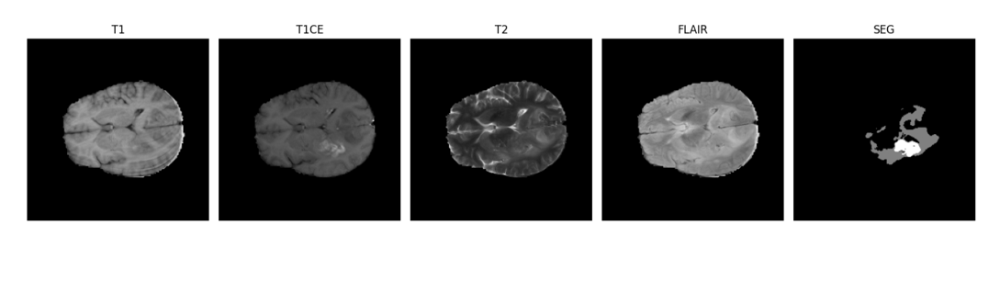

# 🧠 Segmentation des Tumeurs Cérébrales avec MultiEncoder UNet et Fusion par Ondelettes

## 📌 Description
Ce projet propose un modèle de Deep Learning basé sur l’architecture **MultiEncoder UNet** avec **fusion par ondelettes 3D** et un **module d’attention contextuelle (GCAM)** pour la segmentation automatique d’IRM cérébrales 3D à partir du dataset **BraTS 2021**.  

---

## 🎯 Objectifs
- Segmenter automatiquement les différentes zones tumorales :  
  - **Nécrose**  
  - **Œdème**  
  - **Tumeur active**  
- Exploiter la complémentarité des modalités IRM (T1, T1ce, T2, FLAIR).  
- Améliorer la précision grâce à la **fusion multi-modale par ondelettes** et à l’**attention globale**.  

---

## 🗂️ Données utilisées
- **Dataset** : [BraTS 2021](https://www.kaggle.com/datasets/awsaf49/brats20-dataset-training-validation)  
- **Patients** : 1251 (IRM multimodales + masques de segmentation)  
- **Modalités IRM** :  
  - T1 : vue anatomique  
  - T1ce : post-contraste (tumeur active)  
  - T2 : œdème  
  - FLAIR : zones pathologiques  
- **Classes de segmentation** :  
  - 0 : tissu sain  
  - 1 : nécrose  
  - 2 : œdème  
  - 4 : tumeur rehaussée par contraste  

📷 *Exemple d’IRM multimodales et segmentation*  
  
  

---

## ⚙️ Méthodologie

### 🔹 Prétraitement des données
- Normalisation, recadrage et redimensionnement  
- Data augmentation (flip, translation, bruit d’intensité)  

### 🔹 Architecture du modèle
- Multi-encodeurs 3D (un par modalité IRM)  
- Fusion par ondelettes 3D (**WFM**) pour combiner basses et hautes fréquences  
- Module d’Attention Contextuelle (**GCAM**) pour capturer les dépendances globales  
- Décodeur 3D avec **skip connections fusionnées**  

📐 *Schéma du modèle*  
  

### 🔹 Entraînement
- Fonction de perte hybride : **BCEDiceLoss (BCE + Dice Loss)**  
- Optimiseur : **Adam**, learning rate initial `1e-5` avec décroissance polynomiale  
- Validation croisée sur le dataset BraTS  

### 🔹 Évaluation
- **Dice Similarity Coefficient (DSC)**  
- **Hausdorff Distance 95% (HD95)**  
- Visualisation des résultats de segmentation  

---

## 📊 Résultats
- La combinaison **WFM + GCAM** a permis une **amélioration significative du Dice Score** et une **réduction de la distance HD95**.  
- La **fusion tardive** (multi-encodeurs + ondelettes) donne de meilleures performances que la fusion précoce.  

📈 *Exemple de segmentation prédite vs vérité terrain*  
  

---

## ✅ Conclusion & Perspectives
- Le modèle optimise l’exploitation des modalités IRM et capture efficacement le contexte spatial global.  
- **Limites** : complexité computationnelle élevée, besoin d’un dataset multimodal de qualité.  
- **Perspectives** :  
  - Optimisation architecturale  
  - Intégration de **Transformers 3D**  
  - Réduction de la charge (quantification, pruning, etc.)  

---

## 🛠️ Technologies utilisées
- **Langage** : Python  
- **Frameworks** : TensorFlow, Keras  
- **Bibliothèques** : Nibabel, NumPy, Pandas, Matplotlib, Seaborn  
- **Outils** : Jupyter Notebook  

---

## 👩‍💻 Auteur
**Ait Belfakih Chaymae**  
🔗 [LinkedIn](https://www.linkedin.com/in/chaymae-belfakih-b97226342/) | [Kaggle](https://www.kaggle.com/chaymaaitbelfakih)  
